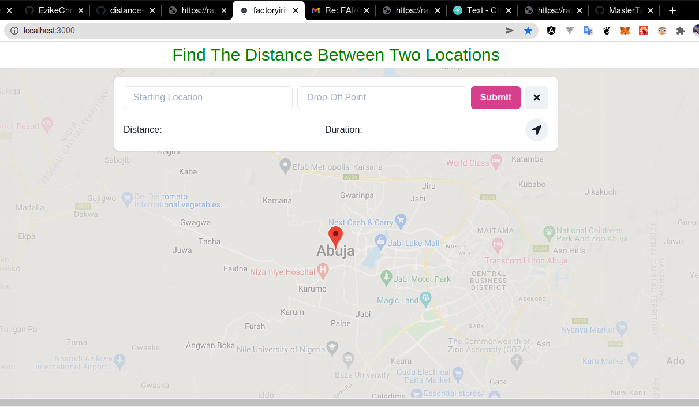

# Route Location
Route Location is a simple application that shows the route for the places you want to go to. You set your starting point and drop-off point. 
It Then uses Google's Maps API with React.js to waypoint that location.




## Project setup
```
yarn install
```

### Compile and hot-reloads for development
```
yarn run serve
```
### Google Map API key
Create an API in the google developers console [https://console.developers.google.com](https://console.developers.google.com)

Add a `.env` file or `.env.local` in the project root and specify your API key as `REACT_APP_GOOGLE_MAPS_API_KEY= Place Your Api Key Here`


### Customize configuration
